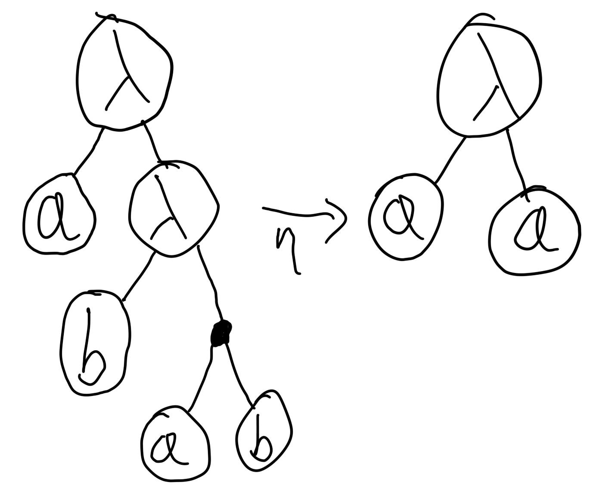
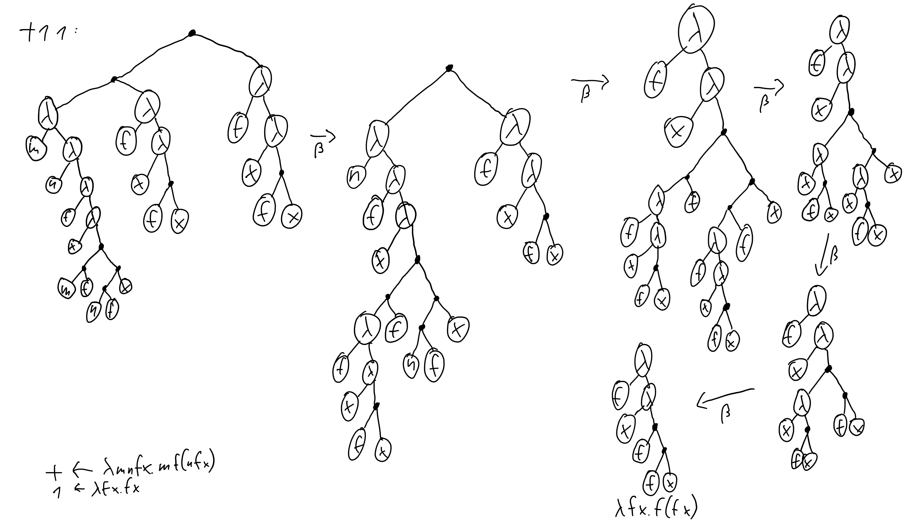

# λ

```
λλλλλλλλλλλλλλλλλλλλλλλλλλλλλλλλλλλλλλλλλλλλλλλλλλλλλλλλλλλλλλλλλλλλλλλλλλλλλλλλ
```

This is an implementation of the λ calculus in Rust. It has a few niceties to
make it more of a usable programming language. As a mathematician/computer
scientist, you should be familiar with the basic syntax: `λa.a` is the Identity
function. We also support the shortened syntax, so that `λa b.a` is the Kestrel
(constant function). It is transparently π-expanded to `λa.λb.a` by the parser.
Additionally, you can define constants and assign variables: `I ← λa.a`,
`😈 ≔ (λf.f f)(λf.f f)`. The key difference is that the interpreter tries to
keep definitions as symbols, while assigned variables are just replaced
transparently. For example, the expression `I I` will yield `I`, if it was
_defined_, and `λa.a`, if it was _assigned_ (to that value). Assignments may
use `≔` or `≡`, `:=` and `=` are up for future consideration. Also, there may
be 2 more dialects in the future:
single-letter-form (`λab.a` instead of `λa b.a`) and
μhs/MicroHaskell (`I a = a` instead of `I ≔ λa.a`, or `I ← λa.a`).

> But how do you run programs using this notation?

That’s pretty simple: You mutate it, in different ways. The normal computations
are done using β-reduction, but the other procedures are also important.

## α-renaming

This is probably the most complicated algorithm as there is no obvious approach.

Take the identity function `λa.a`. It can also be expressed as `λb.b`, `λc.c`,
`λα.α`, `λÄ.Ä`, `λᴍʏᴠᴀʀɪᴀʙʟᴇ.ᴍʏᴠᴀʀɪᴀʙʟᴇ`, `λ🏳️‍⚧️.🏳️‍⚧️`, or any other
way to replace `a` everywhere in the function. This works as long as our new
symbol doesn't appear freely in our original function. For example, α-renaming
a function `λa.λb.a` to `λa.λa.a` is wrong, because `a` is free in `λb.a`.

This might seem simple, but, as I already said, it isn't. The difficult part is
determining, where to α-rename to which variable names. That has no standard
solution.

## β-reduction

The most important part.

Take the term `(λa.a)(λb.b)`. It being β-reduced is commonly written as
`(a)[a := (λb.b)]`, which results in `λb.b`.

In a general way, the term `(λx.f x)y` is β-reduced to `f y`.

To give you another example, let's add one and one:

```λ

+ 1 1 = (λm n f x . m f (n f x))(λf x.f x)(λf x.f x)
→ (λn f x . (λf x.f x) f (n f x))(λf x.f x)
→ λf x . (λf x.f x) f ((λf x.f x) f x)
→ λf x . (λx.f x) ((λx.f x) x)
→ λf x . (λx.f x) (f x)
→ λf x . f (f x) = 2
```

## η-reduction

This is quite simple, you might also know it as “point-free programming”.

A function `λx.f x` can be written as `f`. That's it!

A real world example: You want to define a function for adding two. The obvious
solution would be `add-two ← λ x . + 2 x`. But if you want to feel like a
**real** badass hacker, you can write it as `add-two ← + 2`.

Most Haskell linters even force you to write your code this way, and you should.

## ι-expansion

This one implements unsigned integers aka natural numbers.

When [generating ASTs](#implementation-details), integers are automatically
ι-expanded like this:

```
num = Σ("x")
for(; i > 0; i--):
  num = Α("f", num)
return Λ("f", Λ("x", num))
```

This gives you the correct Church encodings for all unsigned integers:
0 → `λf x.x`, 1 → `λf x.f x`, 2 → `λf x.f (f x)`, …

## π-expansion

Here, functions with multiple parameters are converted into proper λ-calculus.

For example, the function `λa b.a` is expanded into `λa.λb.a`.

It works like this:

```
func = body
for param in params.reverse():
  func = Λ(param, func)
return func
```

## Implementation details

<!--TODO: document the AST format better-->

We use `pest` to parse your statements into a high-level AST, then we generate
proper ASTs from that. Those basically look like that:



`λa b.a b` η-reduces to `λa.a`.

Here's how to add 1 and 1 using β-reduction:


