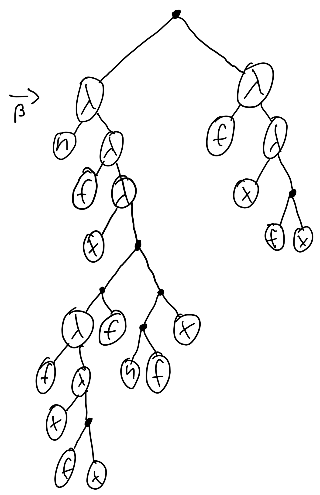
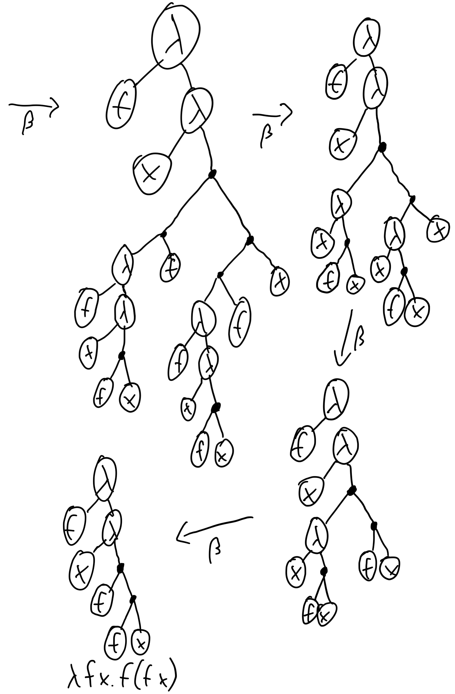

# λ

```
λλλλλλλλλλλλλλλλλλλλλλλλλλλλλλλλλλλλλλλλλλλλλλλλλλλλλλλλλλλλλλλλλλλλλλλλλλλλλλλλ
```

This is an implementation of the λ calculus in Rust. It has a few niceties to
make it more of a usable programming language. As a mathematician/computer
scientist, you should be familiar with the basic syntax: `λa.a` is the Identity
function. We also support the shortened syntax, so that `λa b.a` is the Kestrel
(constant function). It is transparently expanded to `λa.λb.a` by the parser.
Additionally, you can define constants and assign variables: `I ← λa.a`,
`😈 ≔ (λf.f f)(λf.f f)`. The key difference is that the interpreter tries to
keep definitions as symbols, while assigned variables are just replaced
transparently. For example, the expression `I I` will yield `I`, if it was
_defined_, and `λa.a`, if it was _assigned_ (to that value). Assignments may
use `≔` or `≡`, `:=` and `=` are up for future consideration. Also, there may
be 2 more dialects in the future:
single-letter-form (`λab.a` instead of `λa b.a`) and
μhs/MicroHaskell (`I a = a` instead of `I ≔ λa.a`, or `I ← λa.a`).

## Implementation details

We use `pest` to parse your statements into a high-level AST, then we generate
proper ASTs from that. Those basically look like that:


`λab.ab` η-reduces to `λa.a`.

Here's how to add 1 and 1 using β-reduction:




